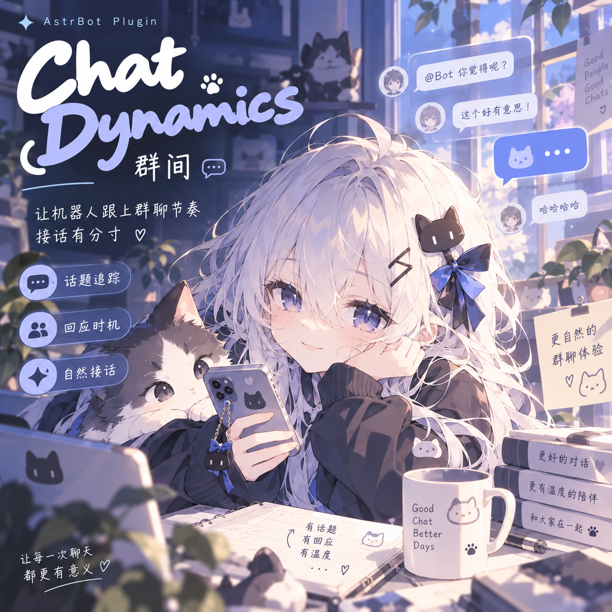

<div align="center">



# 群间 · Chat Dynamics

让机器人跟上群聊节奏，接话有分寸。

</div>

AstrBot 群聊互动插件：合并碎发、追踪话题、判断回应时机，并调整回复节奏。支持沿用当前人设，由模型决定何时参与、回应谁。

## 能做什么

- **等你说完**：合并同一用户的连续消息，减少抢答和重复回复。
- **接对话题**：结合引用、@ 和短期上下文，区分多人交错的讨论。
- **读懂场合**：结合群聊氛围、社交分寸与冷却状态，控制参与程度。
- **自然回应**：按内容调整等待和分段，兼顾闲聊与认真讨论。
- **看得见、管得住**：控制台查看决策原因、会话状态和话题图谱，支持观察、冷却与重置。

### 流式话题归属

群聊默认可以没有话题：同一讨论在 60 秒内至少出现 4 条不同的有效文字消息、2 位真人参与，并有回复或语义联系，才确认成题。图片/表情占位、重复内容、语气词与机器人消息不计入强度；未成题时不调用话题 LLM 或生成标题，回放时间轴留白。成题后的模糊消息先保留为待定，不进入正式话题画像；后续明确回复，或高置信推断承接并提供独立话题证据时可回填。观察三条后续消息或超过 30 秒仍无法确定，保留为未知。话题画像结合质心、代表消息、最近两轮、回复关系、对话对象、时间与词汇；短句按候选话题提供上下文，引用中的明显话题切换允许另开话题。

沉寂话题使用会话内摘要检索召回原话题 ID，每会话最多 32 条、保留 24 小时，重置后清除，正常重载后恢复。它不替代实时路由，也不依赖外部向量库或较新版本的群消息历史 API。

`topic_reranker_enabled` 默认开启，在达到成题强度后对模糊候选及拟新建话题调用 LLM 聚合辅助，减少同一讨论被拆成多个话题。已显式设为 false 的配置仍保持关闭。`topic_reranker_provider` 留空使用当前会话模型，`topic_reranker_timeout` 默认 3 秒；失败或无法确认时保留本地判断；模型不会仅因相同参与者或泛技术类别而合并话题。

消息摄入和最终判定在会话锁内执行，Embedding 与话题 LLM 请求在锁外等待；返回后校验会话、代际、消息身份等状态。显式唤醒不等待这些辅助请求，旧请求不能覆盖重置后的状态或更新的回复判定。话题画像只刷新受影响的话题，并缓存最多两个完整或历史视图；消息、路由证据与向量变化时自动失效。

场景回放中点击话题块，可逐条标注正确归属、新话题或无法判断，并选择合并、拆分、误归属、过早归属、历史召回遗漏等错误类型。标注独立保存，每会话最多 2000 条，可导出 JSON 和混淆计数，不直接修改实时路由。默认不保存消息正文；开启控制台消息内容显示后才保存正文。评分是启发式证据强度，人工样本统计也不等同于真实群聊准确率。

另有媒体门闩、今日作息、群记忆小本，以及 Self Learning / LivingMemory 可选联动。

## 快速开始

环境要求：**AstrBot >= 4.16、< 5，Python 3.12+**。

1. 在 AstrBot 插件管理中使用仓库地址安装：
   ```text
   https://github.com/ysyhlly/astrbot_plugin_chat_dynamics
   ```
2. 在插件配置中填写 `takeover_groups`（生效群 ID）和 `bot_names`（完整昵称）。
3. 保持默认 `decision_mode=legacy`、`pipeline_mode=filter`，先开启 `shadow_mode` 观察。
4. 在测试群用 @、引用和连续碎发检查表现，再关闭 `shadow_mode` 使插件实际介入。

**默认不处理任何群**：白名单为空且 `takeover_all=false` 时不会生效。`exclude_groups` 的优先级高于白名单和全群开关。

## 两种互动模式

| 模式 | 如何决定回应 | 适用场景 |
| --- | --- | --- |
| `legacy`（默认） | 按防抖、指代、氛围与冷却规则处理 | 希望先控制回复时机与节奏 |
| `persona_model` | 模型先判断是否参与及回应对象，再由 AstrBot 主 Agent 回复 | 希望互动更贴合当前人设 |

人设模式沿用当前会话的 AstrBot 人格、历史与工具配置。设置 `decision_mode=persona_model` 即可启用；`decision_provider` 留空时沿用主回复 Provider。未被 @ 的消息也可能触发决策，`ambient_intervention` 不再单独控制是否开口；管理员冷却仍然有效。决策超时或结果无效时，仅明确求助会保守交给 Agent。

观察模式不会改动宿主回复；**人设模式下仍会调用决策模型，产生调用费用**。建议先在一个群观察，再正式启用；切回 `legacy` 可回退。

`pipeline_mode=filter` 是默认过滤链路；`exclusive` 会独占拦截事件，影响后续插件。原生直通和人设模式主 Agent 桥接支持宿主人格、历史与工具，legacy 延迟回复路径不保证完整宿主管线能力。

## 常用配置

参数页默认只显示 7 项常用设置：启用、生效范围、排除群、昵称、决策模式和参与分寸。初次使用只需填写生效群号，再点「保存并应用」；昵称可不填，直接 @ 机器人即可。模型字段留空时沿用既有回退规则，无需为插件单独选择模型。

页面会显示当前是否已选择有效群聊，以及是否处于观察模式。需要微调模型、阈值、节奏或联动时，切换「高级设置」；搜索始终查找全部参数。切换视图不会清空修改，也不会重置高级配置。

| 配置项 | 默认值 | 说明 |
| --- | --- | --- |
| `takeover_groups` | `[]` | 生效群白名单 |
| `takeover_all` | `false` | 对所有未排除的群生效 |
| `exclude_groups` | `[]` | 排除群黑名单 |
| `bot_names` | `[]` | 机器人完整昵称，避免易误判的短词 |
| `reply_provider` | 空 | 留空依次使用旧 `provider`、当前会话 Provider |
| `shadow_mode` | `false` | 只观察预计行为 |
| `presence_knob` | `sensible` | 分寸旋钮，默认「懂事」 |
| `ambient_intervention` | `false` | legacy 模式允许未被点名时按规则插话 |
| `debounce_base_cooldown` | `3.5` | 连续消息的基础等待秒数 |
| `console_show_message_content` | `false` | 是否在控制台显示截断的消息正文 |

更多参数及范围见插件配置页面或仓库中的 `_conf_schema.json`。氛围 LLM 和神经 Embedding 默认关闭，可按需开启。

## 控制台与指令

在 AstrBot 管理面板打开「群聊动态控制台」，查看活跃会话、决策原因、冷却、防抖积压和对话图谱。页面每 5 秒刷新，消息正文默认脱敏；支持日间／夜间主题。

| 指令 | 权限 | 用途 |
| --- | --- | --- |
| `/dynamics status` | 管理员 | 查看当前会话状态 |
| `/dynamics cool [分钟]` | 管理员 | 开启冷却，指定时长为 1–180 分钟 |
| `/dynamics reset` | 管理员 | 清空当前会话图谱、遥测和冷却，取消待处理输入与在途回复 |
| `/dynamics_stop` | 群成员 | 停止自己当前尚未发送的回复内容 |

停止指令只作用于当前会话和发送者，不撤回已发消息；新请求可直接继续。已经执行的外部工具动作不会随停止撤销。

## 使用边界与联动

- **会话隔离与持久化**：状态按完整 UMO（平台、适配器与会话来源）隔离；面板会话、消息图、话题和统计通过 AstrBot 插件 KV 保存，正常重载前完成保存并在启动时恢复，冷却也可跨重载保留。运行中每 30 秒检查一次，仅状态变化后保存，异常断电可能丢失最后一个保存周期的数据；清空会话会同步更新保存结果。历史数据仍遵循容量与过期清理规则，未发送任务不会恢复执行。
- **设置页**：支持搜索设置项、全部展开或收起分组，并在当前浏览器记住分组展开状态；参数通过“保存设置”写入配置。
- **媒体理解**：媒体门闩用于判断是否适合接话，深入理解需相应开关及宿主、适配器、Provider 支持；人设模式可向 Agent 传递附件。
- **今日作息**：模拟群聊中的作息氛围。普通晚安仅在当地 22:00–06:00 进入夜间收束，白天不会因此睡到次日；管理员强制入睡仍生效。高级设置中的 `rhythm_timezone` 支持 `Asia/Shanghai` 等 IANA 时区，留空沿用宿主操作系统本地时区；UTC 容器可显式设为所在时区。
- **记忆联动**：支持 Self Learning / LivingMemory 的宿主钩子及部分分支直连接口。关闭 `selflearning_integration` 只关闭本插件的桥接，其他插件自己的钩子由其自身配置管理。
- **调度兼容**：同一群建议由一个插件负责回复调度，避免与 Group Chat Plus 等插件竞争。

## 开发与文档

```bash
python -m pip install -r requirements-dev.txt
python -m pytest tests -q
python -m pytest integration -q  # 需安装真实 AstrBot SDK
python -m ruff check main.py core tests integration scripts
python scripts/check_release.py
```

普通单元测试可能使用 SDK 替身；真实 SDK 契约测试与实际群适配器、媒体和 Dashboard 验收需分别进行。

- [会话路由说明](docs/conversation-router.md)
- [记忆联动说明](docs/companion-integration-fix-2026-09-07.md)
- [直连接口覆盖](docs/selflearning-api-coverage.md)
- [更新记录](CHANGELOG.md) · [MIT License](LICENSE)

插件标识保持 `astrbot_plugin_chat_dynamics`，已有配置与 `/dynamics` 指令继续使用。

启用话题 LLM 辅助后，每个活跃话题首次处理时生成一次简短中文标题。标题显示于场景回放；关闭消息内容显示时仍使用匿名话题编号。标题在后台生成，不占用回复判定的等待时间。生成失败保留原有摘要标题，按 30 秒起、最长 300 秒的指数退避，在后续消息到来时重试；同一话题只允许一个标题请求在途。

短句成题检查：语气词、应答词和信息不足的片段先保持待观察，不创建独立话题或生成标题。可承接已有话题；明确后续回复补足内容后才确认。超时仍未知，不强制归类。

### 回复超时与兼容降级

`reply_timeout` 默认 60 秒（5–300），覆盖普通回复的 Provider 查找和模型请求；`tool_agent_timeout` 默认 120 秒（5–600），覆盖原生工具 Agent，以及人设模式的一次完整处理流程。`decision_timeout` 继续独立控制决策模型。超时取消本次处理并释放生成名额，后续请求仍可继续；不会自动重试可能已经执行过的工具。

启动时若所需人设桥接不可用，插件使用规则模式并在控制台显示原因，保留用户原配置。修复依赖后重载可恢复；配置页仍可以切回规则模式。主动启用不可用的人设模式仍在保存前报告错误。

情绪与群记事本使用宿主 `StarTools.get_data_dir("astrbot_plugin_chat_dynamics")` 目录。旧源码目录中的文件会复制保留，不覆盖新目录已有文件，也不删除源文件。新文件名带 UMO 哈希，内容记录完整 UMO；没有身份信息的旧文件无法安全区分文件名碰撞，保留备查但不自动归入当前会话。
