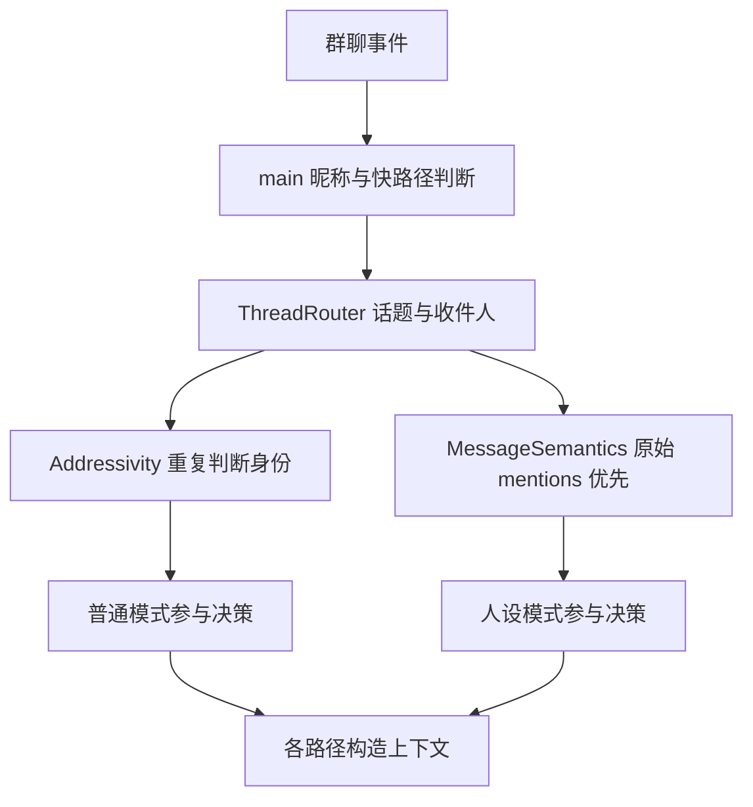
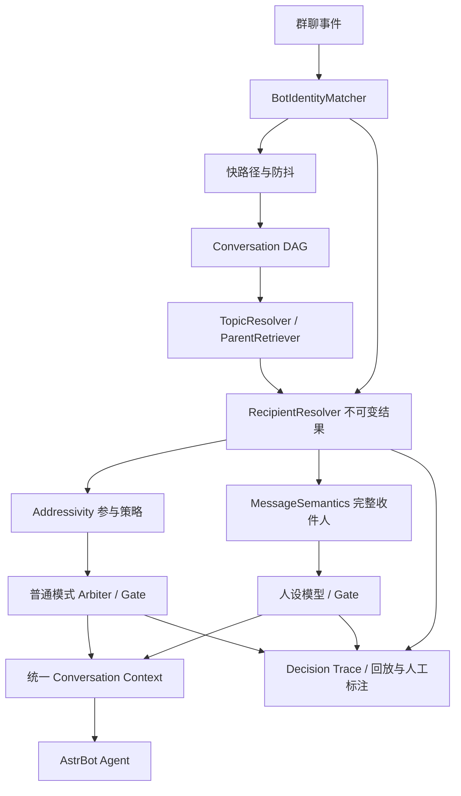

# 群聊表现优化实施记录

本文件记录 v1.4.2 的落地过程与实测结果；设计与验收口径见
[v1.4.2 群聊优化设计](v1.4.2-group-chat-optimization.md)。本轮在 v1.4.1 工作区落实
讨论中的确定性修复与评估护栏，并随 v1.4.2 发布。

## 架构变化

此前身份匹配分散，ThreadRouter 产生收件人后，Addressivity 和消息语义
仍可能按另一份规则覆盖它；话题歧义也参与了收件人降级。

现在共享身份匹配；RecipientResolver 是新路由的收件人所有者，
Addressivity 对明确结果只决定参与强弱，旧无路由调用保留兼容回退。

这里保留了 Topic/Parent 先产生上下文候选的现有调用顺序；未宣称已实现
“先完整解析 Recipient 再检索 Topic”的无循环目标架构。

## 已落实

- 独立 topic/addressee 歧义；旧快照兼容；话题回填保持各消息收件人证据。
- Bot 呼语、提及、讨论对象独立匹配，支持多人收件人、单字中文昵称，避免名字子串误命中。
- 快路径使用同一匹配器，清理呼语时只删识别到的位置；短句续聊仍要求用户、时间和对话连续性证据。
- 普通与人设路径记录 schema 2 trace，最终参与闸门执行前 `should_reply` 为 null。
- 固定离线回放、改前基线、改后报告、CI 检查；只读比较报告，不在活会话中运行第二个可写路由器。
- 收件人标注 schema v2、回放编辑、持久化快照和导出；旧话题标注继续可用。
- 自有与 native 上下文共用构建器，背景逐条限制 1200 字，保留归因与社交提示；自有请求不重复注入 DAG。
- Embedding 单飞保留，有界请求与重配置代次隔离；backend 是每次匹配结果的一部分。
- 复用已有话题画像缓存，去掉神经查询路径不必要的哈希计算及重复过滤。
- 快路径按“称呼之后还剩多少内容”判断，而不是删除全部名字子串；显式要求继续说完时仍进入防抖。

## 回放结果的含义

固定 14 个合成场景中，普通与人设模式的 Bot 目标漏判均从 3 降至 0，
误判均为 0；多人收件人还核对完整 ID 集合。每例同时锁定收件人层级
（strong / hover / weak），其中旁观者短句续接为静默 hover，作为后续参与策略
工作的可见边界。详见[基线](routing_baseline.json)和[当前报告](routing_current.json)。
基线取自首步歧义 hotfix 之后、此次身份与收件人统一之前的隔离源码快照。
这是确定性回归护栏，不是在线回复率、真实准确率或最终发送承诺。
人设模型仍可根据内容和参与闸门选择不回复。

## 经过核实后保留的行为

讨论中的部分优化属于需要数据的实验，不应当作确定缺陷直接上线：

- 话题画像缓存、同文本 embedding 单飞、自有请求防重复首闸门原已存在。
- Top-K shortlist 会改变候选召回，70% 向量覆盖会引入暖缓存顺序偏差；本轮不改变默认阈值。
- 不缓存 provider 对象，以免宿主热替换 provider 后继续使用旧实例。
- 不按 14 个合成场景调整 Participation 的软证据权重或 cap；先积累标注并验证漏判与插话的双向指标。
- 不移动发送锁或大拆 main.py；这些属于独立的顺序、取消与发送生命周期改造。
- 标注快照可离线核查，完整真实对话重放仍需用户明确提供上下文；不会默认采集完整群聊。

这些取舍和后续实验门槛分别见 [评估工具](routing_evaluation.md)、
[话题优化](topic_optimization.md)、[Embedding](embedding_changes.md)、
[标注](recipient_annotations.md)。
