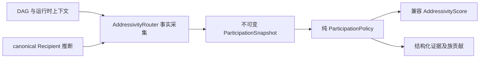

# ParticipationPolicy：等价拆分与证据账本

本次把“是否参与”的生产评分从 `AddressivityRouter` 抽出为纯策略，保留原默认阈值（strong 0.70、hover 0.40）、全部权重、理由和 pending-hover 的 0.28 上限。证据族只是记录贡献，尚未增加去相关上限或重新调参。

适配器保留原构造参数、`compute_addressivity` 调用方式及辅助方法，收集身份、reply、时间、插话数量、语义匹配、显式 thread 和 hover 事实。策略不访问 DAG、时钟、模型或消息正文，也不重新调用身份或收件人推断。确定的 schema-2 recipient 优先于旧路径证据；无确定 recipient 时按原兼容顺序处理显式事实与软评分。显式结果不触发语义匹配。

`RecipientSnapshot`、`ParticipationSnapshot`、`Evidence` 和策略结果均为 frozen dataclass，嵌套集合为 tuple。`Evidence(code, family, strength, source)` 在输入中表达观察量（如间隔秒数）；输出 `evidence` 表达实际加减分贡献。原人类可读理由单独保留，不将理由、消息文本、昵称或 lexical token 写入 trace。

`AddressivityScore` 原字段保持不变，增加：

- `evidence`：已应用的结构化贡献，含基线和零分插话证据。
- `family_contributions`：baseline / recipient / platform / temporal / dialogue / topic 六族分别求和。
- `contribution_total`：所有实际贡献之和，保留既有 hover cap 之后、最终 [0,1] clamp 之前的总分；确定收件人的固定结果直接记录该分数。

`build_routing_trace` 接受上述三个同名 participation 字段，仅导出已知 code、family、source 和有限数值，剔除未知字段。state 另支持 `waiting_for_answer`（可空）、`last_bot_was_question`、`last_bot_message_id`。`should_reply` 仍由真实执行路径填写，策略强指向不等于消息已发送。

回归护栏包含抽取前保存的 29 组 golden（全部公共结果字段）、既有地址性测试、不可变性、硬收件人优先、账本守恒、原 hover cap 及 trace 隐私测试。golden 保存在 `tests/fixtures/participation_legacy.json`，不能通过重录结果掩盖行为变化。
